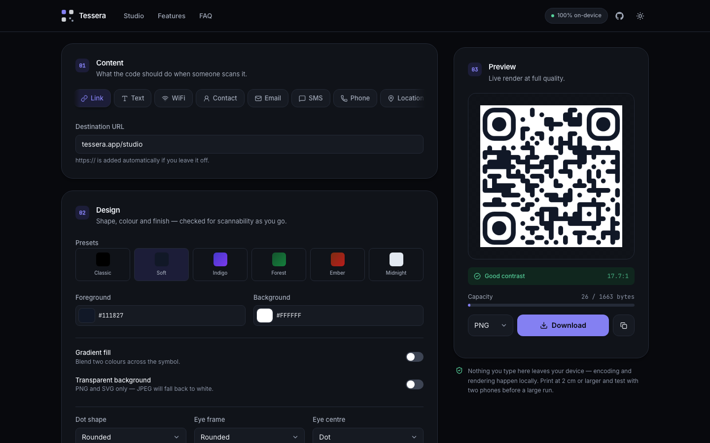
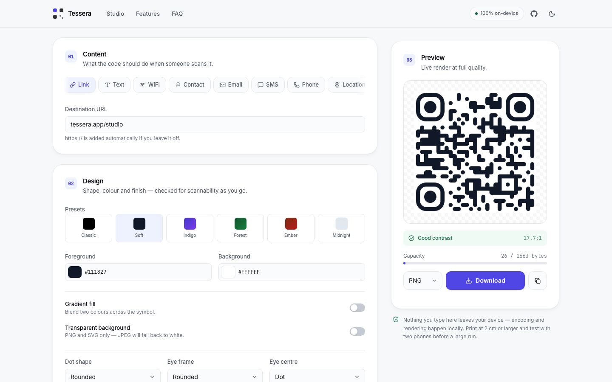
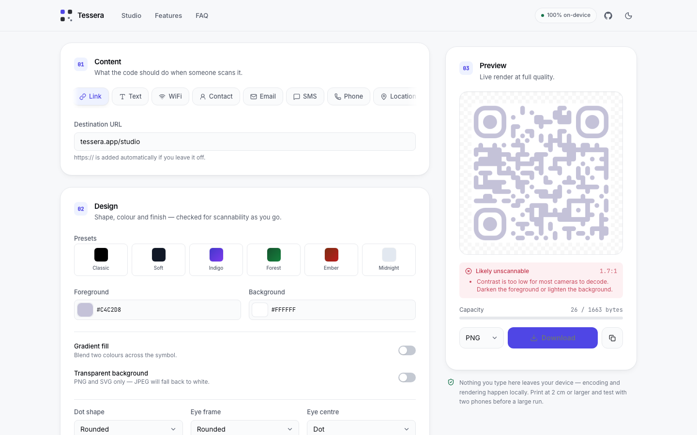
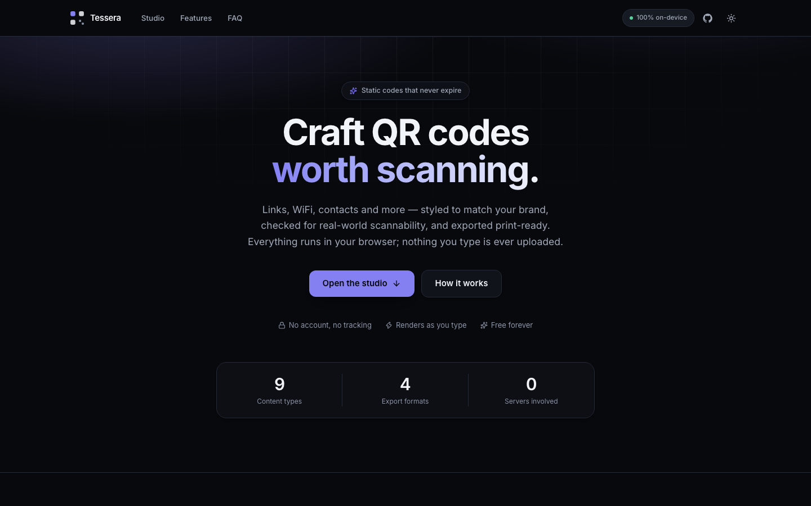
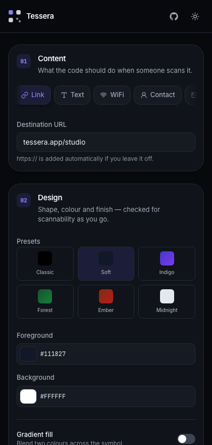

# Tessera

**Craft QR codes worth scanning.**

[](https://github.com/GgauravJ05/tessera-qr/actions/workflows/ci.yml)
[](LICENSE)
[](CONTRIBUTING.md)

**[Open the studio →](https://tessera-qr.vercel.app/)**

A QR code studio that runs entirely in the browser. Pick what the code should
do, style it, and take the file — nothing you type is ever sent anywhere, and
the codes are static, so they keep working after this site is gone.

Most free QR generators either wrap your link in a redirect that dies when the
free tier ends, or let you pick colours that look great on screen and fail on
paper. Tessera does neither: it encodes the payload directly into the symbol,
and it checks contrast and capacity while you design.



<table>
  <tr>
    <td width="50%"></td>
    <td width="50%"></td>
  </tr>
  <tr>
    <td><em>Light theme — the same studio.</em></td>
    <td><em>A pretty colour pair, caught before it reaches a printer.</em></td>
  </tr>
</table>

## Features



**Nine content kinds** — URL, plain text, WiFi credentials, vCard contacts,
email, SMS, phone, geo coordinates and calendar events. Each tab keeps its own
draft, so switching away and back is lossless.

**Live scannability check.** Colour choices are rated against real decoder
behaviour, not WCAG text thresholds: below **3:1** most phone cameras fail
outright, and **3–4.5:1** only decodes in good light on a clean print. The
studio also warns when the symbol is lighter than its background, which older
dark-on-light-only scanners cannot read.

**Capacity metering.** The payload is measured in bytes against the real
version-40 byte-mode limit for the selected error correction level (2953 at L
down to 1273 at H), so you find out you have overflowed the symbol _before_ you
export instead of after.

**Design controls.** Dot, corner-square and corner-dot shapes; solid or
gradient foreground; transparent background; a centre logo with adjustable size
and quiet margin; and error correction from L to H.

**Export** to PNG, SVG, JPEG or WebP at up to 4096 px, or copy the PNG straight
to the clipboard. Exports re-render at full output resolution rather than
upscaling the preview.

**Works offline, and installs.** Everything the app needs is precached by a
service worker on first visit, so the studio keeps working with the network
off — and it can be installed to a home screen or dock as a standalone app.
The fonts are self-hosted rather than pulled from Google, so after the first
load the app makes no network request at all, to any origin.

**Correct payload escaping.** Reserved characters are escaped per scheme — a
WiFi password containing `;` or `:`, or a vCard field containing a comma, would
silently truncate the payload in a naive generator.

## Tech

React 19 · TypeScript 7 · Vite 8 · Tailwind CSS v4 · `qr-code-styling` ·
`vite-plugin-pwa` (Workbox) · Vitest + Testing Library · oxlint · Prettier

No backend, no analytics, no third-party requests — not even for fonts.
Encoding and rendering happen on the device, and a service worker precaches
the build so it runs with no connection at all.

## On a phone

The studio is built to work at 320px and up — the content tabs scroll
horizontally, the panels stack, and the preview stays on screen.

<p align="center">
  
</p>

## Getting started

```bash
npm install
npm run dev
```

Then open the URL Vite prints (usually http://localhost:5173).

## Scripts

| Script               | What it does                       |
| -------------------- | ---------------------------------- |
| `npm run dev`        | Start the dev server               |
| `npm run build`      | Typecheck, then build to `dist/`   |
| `npm run preview`    | Serve the production build locally |
| `npm test`           | Run the test suite once            |
| `npm run test:watch` | Run tests in watch mode            |
| `npm run coverage`   | Test suite with a coverage report  |
| `npm run typecheck`  | Typecheck without emitting         |
| `npm run lint`       | Lint with oxlint                   |
| `npm run format`     | Format with Prettier               |

## Project structure

```
src/
  components/     UI — studio panels, marketing sections, ui/ primitives
  hooks/          useQrCode (owns the QRCodeStyling instance), useTheme
  lib/
    payload.ts    Builds the encoded string per content kind, with escaping
    validation.ts Field validation and byte-capacity assessment
    contrast.ts   WCAG luminance maths and the scannability rating
    qrOptions.ts  Maps app style state onto qr-code-styling options
    defaults.ts   Empty drafts and the default style
  types/qr.ts     The content and style type model
  assets/fonts/   Self-hosted Inter and JetBrains Mono (SIL OFL 1.1)
```

The encoding logic lives in `src/lib` with no React dependency, which is where
the test suite is aimed — 77 tests covering payload construction, escaping,
validation and the contrast maths.

## Testing

```bash
npm test
```

## Notes on printing

Print at 2 cm or larger, keep the quiet margin, and test with two different
phones before committing to a large run. Raising error correction to Q or H
buys tolerance for a centre logo or for wear on physical media, at the cost of
a denser symbol.

## Contributing

Contributions are welcome — see **[CONTRIBUTING.md](CONTRIBUTING.md)** for the
setup, the checks CI runs, and a walkthrough of adding a new content type.

Two things are worth knowing before you start:

- **Nothing the user types may leave their device.** No analytics, no
  telemetry, no runtime API calls. This is the product, so a PR that adds one
  will be declined however good the feature is.
- **A QR code that does not scan is a bug**, however good it looks. Changes to
  encoding, validation or contrast need tests.

By participating you agree to the [Code of Conduct](CODE_OF_CONDUCT.md).
Security issues go through [SECURITY.md](SECURITY.md), privately — not the
issue tracker.

## Licence

Tessera is free software under the **[GNU Affero General Public License v3](LICENSE)**.

In plain terms:

- **You may** use, study, share and modify it, including commercially.
- **You must** keep it under the AGPL and preserve the copyright notice.
- **If you modify it and run it as a network service**, you must offer your
  users the complete corresponding source of your modified version. This is
  the clause an ordinary GPL lacks, and it is the reason this project uses the
  AGPL: deploying a changed copy of Tessera as a website is exactly the case it
  covers.

So you are free to fork it, learn from it and build on it. What you may not do
is take this app, put your own name on it, host it, and keep your changes to
yourself.

The app itself carries a source link in its footer, as AGPL §13 requires. If
you deploy a modified version, that link must point at **your** source, not
this repository.

Copyright © 2026 Gaurav Jadhav.

## Author

**Gaurav Jadhav**

- Portfolio — [gauravjadhav.vercel.app](https://gauravjadhav.vercel.app/)
- GitHub — [@GgauravJ05](https://github.com/GgauravJ05)
- LinkedIn — [ggauravj05](https://www.linkedin.com/in/ggauravj05)
- Email — [ggauravj5@gmail.com](mailto:ggauravj5@gmail.com)
